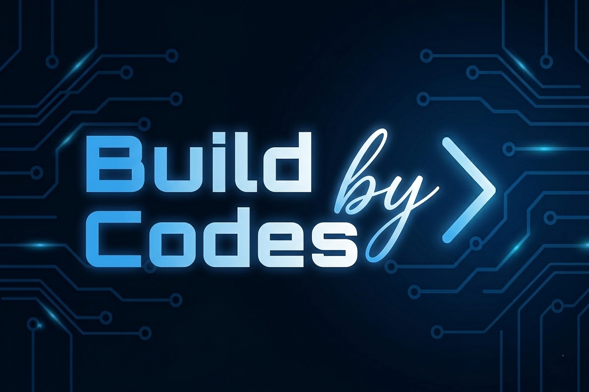

  

# Hi there! I'm a Full-Stack Developer 👋

**Based in Turkey 🇹🇷 | Specialized in Laravel Ecosystem | Open to Global Projects 🌍**

I am a passionate developer dedicated to building robust, scalable, and user-centric web applications. With a focus on the **TALL Stack (Tailwind, Alpine, Laravel, Livewire)**, I bridge the gap between complex backend logic and elegant frontend design.

---

### 🛠 Tech Stack

| Category | Tools & Technologies |
| :--- | :--- |
| **Frontend** |      |
| **Backend** |    |
| **Database/Tools** |    |

---

### 📊 My GitHub Contributions

  
  

---

### 🚀 What I bring to your team:
- **TALL Stack Expertise:** Building reactive interfaces without leaving the comfort of Laravel.
- **Clean Code:** Writing maintainable, PSR-compliant PHP code.
- **Responsive Design:** Crafting mobile-first experiences using Tailwind and Bootstrap.
- **Problem Solving:** Turning business requirements into efficient technical solutions.

---

### 📫 Connect with me

  
  
  

---

  "Turning caffeine into clean, scalable code." ☕✨

